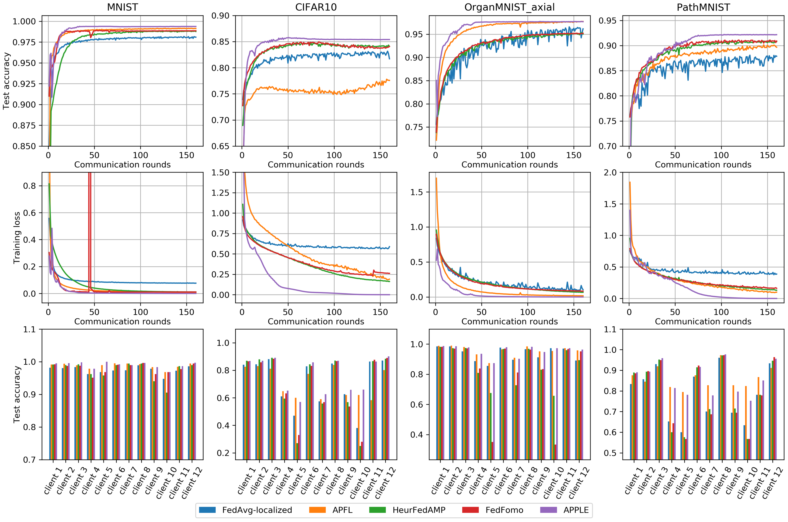

# Adapt to Adaptation: Learning Personalization for Cross-Silo Federated Learning

This repository contains the code and experiemnts for the [IJCAI 2022](https://ijcai-22.org/) paper: [Adapt to Adaptation: Learning Personalization for Cross-Silo Federated Learning](https://arxiv.org/abs/2110.08394), by [Jun Luo](https://www.junluo.me) and [Shandong Wu](https://www.radiology.pitt.edu/profile-detail.html?profileID=906) at the ICCI lab, University of Pittsburgh.

## Abstract

Conventional federated learning (FL) trains one global model for a federation of clients with decentralized data, reducing the privacy risk of centralized training. However, the distribution shift across non-IID datasets, often poses a challenge to this one-model-fits-all solution. Personalized FL aims to mitigate this issue systematically. In this work, we propose APPLE, a personalized cross-silo FL framework that adaptively learns how much each client can benefit from other clients' models. We also introduce a method to flexibly control the focus of training APPLE between global and local objectives. We empirically evaluate our method's convergence and generalization behaviors, and perform extensive experiments on two benchmark datasets and two medical imaging datasets under two non-IID settings. The results show that the proposed personalized FL framework, APPLE, achieves state-of-the-art performance compared to several other personalized FL approaches in the literature. 

## Requirements
To download the dependent packages, in `Python 3.6.8` environment, run
```bash
pip install -r requirements.txt
```

## Datasets

Four datasets are used in our experiments: MNIST, CIFAR10, and two medical imaging datasets from the [MedMNIST collection](https://arxiv.org/abs/2110.14795).

- The two benchmark datasets, namely MNIST and CIFAR10, will be downloaded automatically when running `train_APPLE.py`.
- For the two medical imaging datasets from MedMNIST, namely OrganMNIST (axial) and PathMNIST, one can download them from the [MedMNIST website](https://medmnist.com/) as `./data/organmnist_axial.npz` and `./data/pathmnist.npz`, and run `python split_medmnist.py` inside the `./data/` directory to create a train-test split in a stratified fashion:

## Running experiments

To run the experiments on APPLE, simply run :

```bash
python train_APPLE.py
```
Two figures of the data distribution of the federated datasets (similar to the following figure) will be saved in `./data_dist/` at the beginning of the training.

<p align="center">
  
</p>

Check out the optional training arguments by running:

```bash
python train_APPLE.py --help
```

For instance, if we want to train APPLE for 200 rounds on CIFAR10 under the [practical non-IID setting](https://arxiv.org/abs/2110.08394), with the learning rate for the [core models](https://arxiv.org/abs/2110.08394) equals 0.01 and the learning rate for the [Directed Relationships](https://arxiv.org/abs/2110.08394) equals 0.001, we can run:

```bash
python train_APPLE.py --num_rounds 200 \
                      --data 'cifar10' \
                      --distribution 'non-iid-practical' \
                      --lr_net 0.01 \
                      --lr_coef 0.001
```

By default, the results will be saved in `./results/`. To collect the test results in a table and plot the training curves in one figure, run

```bash
python plot_results.py
```

The figure will be in the following format:


To include results of other methods with the same format into the comparison, add new or exclude existing datasets, or adjust the DPI of the output figures, modify the first block of the `main` function in `plot_results.py`, accordingly. To visualize the trajectory of the Directed Relationship vectors in APPLE, uncomment the last block in the `main` function.

## Citation

If you find our code useful, please consider citing:

```
@article{luo2021adapt,
  title={Adapt to Adaptation: Learning Personalization for Cross-Silo Federated Learning},
  author={Luo, Jun and Wu, Shandong},
  journal={arXiv preprint arXiv:2110.08394},
  year={2021}
}
```

